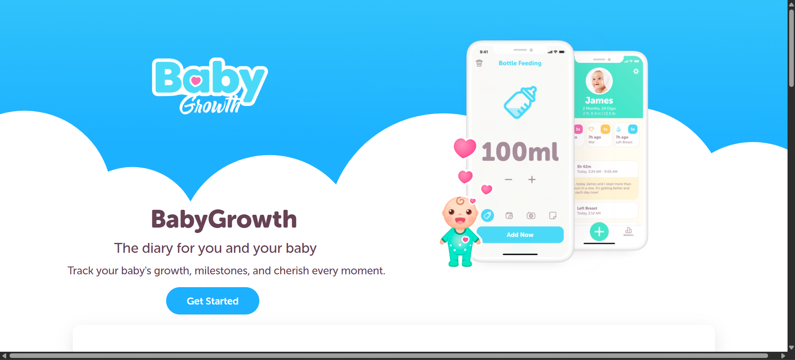
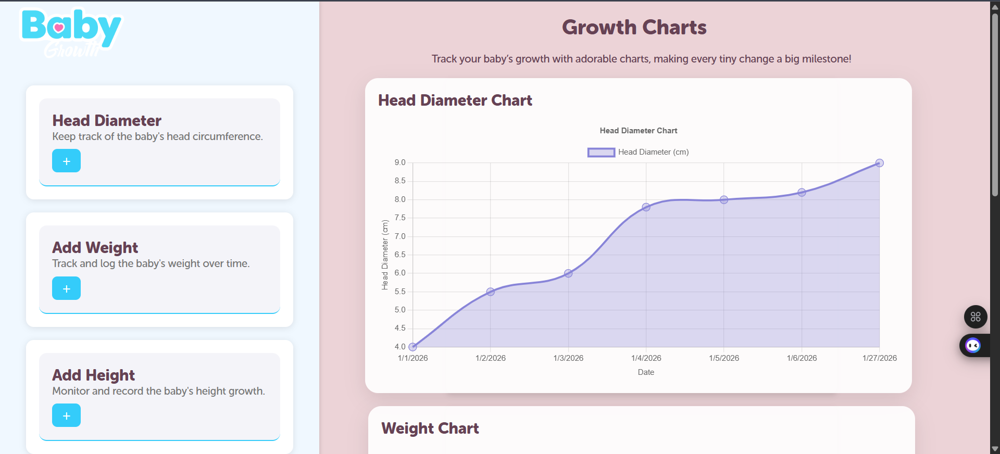

# Baby Growth Tracker 🌱

[](LICENSE)  
[](https://reactjs.org/)  
[](https://nodejs.org/)  
[](https://www.sqlite.org/)  

A **web application** to monitor and track your baby's growth—weight, height, and head circumference—over time. Designed for parents and caregivers to log and visualize growth patterns easily.

---

## 🚀 Features

- **Growth Tracking**: Log and monitor your baby's weight, height, and head circumference over time.  
- **Interactive Charts** 📊: Dynamic graphs to visualize growth trends.  
- **Milestone Tracker** 🍼: Track developmental milestones with reminders.  
- **Vaccination Log** 💉: Schedule and track immunizations.  
- **Secure Data Storage** 🔒: Data is securely stored using SQLite with robust CRUD operations.  
- **Responsive Design** 🌐: Works perfectly on desktops, tablets, and mobile devices.

---

## 💻 Web Application Screenshots

### Dashboard


### Growth Charts



> Replace these screenshots with actual images from your web app inside a `screenshots` folder.

---

## 🛠️ Technologies Used

| Frontend | Backend | Database |
|----------|---------|---------|
| React.js | Node.js | SQLite |
| HTML5 & CSS3 | Express.js | Local DB Storage |
| Chart.js | REST API | Data Management |

---

## ⚡ Installation & Setup

1. **Clone the repository**
```bash
git clone https://github.com/BuddhiDassanayake/baby-growth-tracker-web.git
cd baby-growth-tracker-web